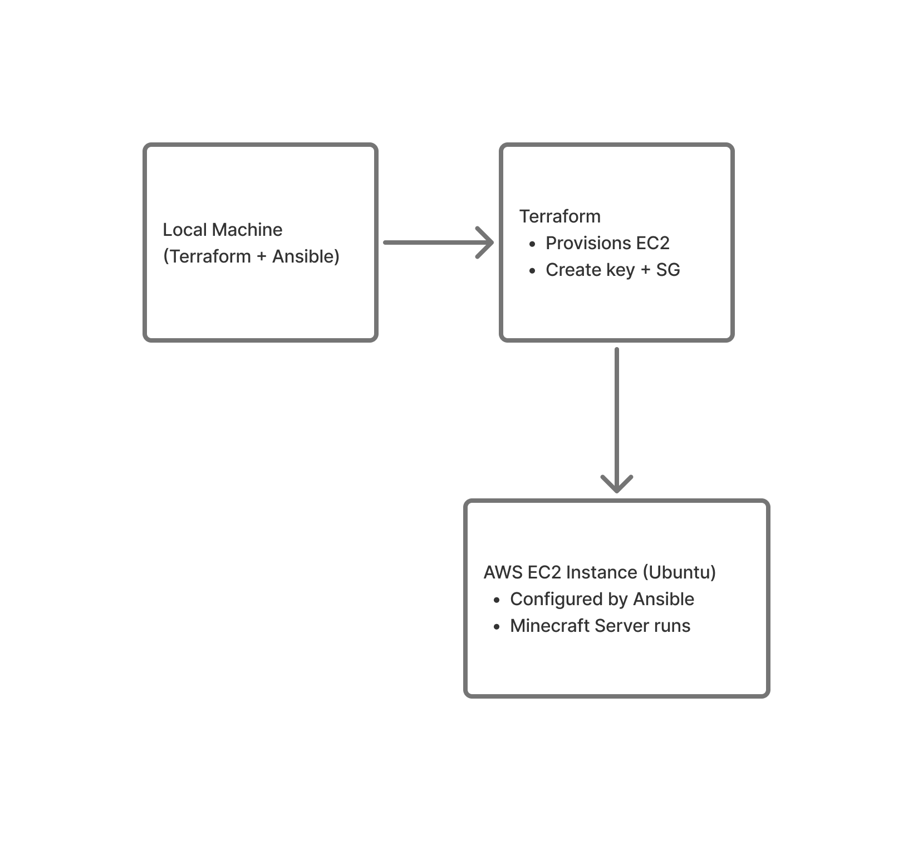

# 🛠️ Automated Minecraft Server Deployment on AWS

## 📘 Background

In this project, we automatically provision and configure a Minecraft server on an AWS EC2 instance using **Terraform** and **Ansible**. Terraform handles infrastructure provisioning (EC2, key pairs, security groups), while Ansible installs Java, sets up the Minecraft server, and ensures it runs as a `systemd` service that auto-starts on reboot.

---

## ⚙️ Requirements

### ✅ Tools Installed

- [Terraform](https://developer.hashicorp.com/terraform/tutorials/aws-get-started/install-cli)
- [Ansible](https://docs.ansible.com/ansible/latest/installation_guide/intro_installation.html)
- [AWS CLI](https://docs.aws.amazon.com/cli/latest/userguide/getting-started-install.html)

### 🔐 AWS Configuration

Configure the AWS CLI on your local machine:

```bash
aws configure set <variable> "<value>"
```

Ensure you're working in the correct region (e.g., `us-west-2`), and that your IAM user has permissions for EC2 and key management.

---

## 🧪 SSH Key Pair

> 🔐 The repository does not include a public key for security reasons.

From the `terraform/` directory:

```bash
ssh-keygen -t rsa -b 2048 -f my-minecraft-key
```

This creates:

- `my-minecraft-key` (private key used for SSH & Ansible)
- `my-minecraft-key.pub` (used by Terraform)

Move the private key to your SSH directory
Restrict permissions on the key file:

```
chmod 400 ~/.ssh/my-minecraft-key
```

```hcl
public_key = file("${path.module}/my-minecraft-key.pub")
```

---

## 📦 Files and Structure

```
CS312_COURSE_PROJECT/
├── .github/
├── ansible/
│   ├── files/
│   │   ├── eula.txt
│   │   └── server.jar
│   ├── inventory
│   └── setup.yml
├── terraform/
│   ├── instance.tf
│   ├── provider.tf
│   ├── terraform.tfvars
│   ├── variables.tf
│   ├── terraform.tfstate
│   ├── terraform.tfstate.backup
│   ├── .terraform/
│   ├── .terraform.lock.hcl
│   ├── my-minecraft-key
│   └── my-minecraft-key.pub
├── .gitignore
└── README.md

```

---

## 📈 Pipeline Diagram



---

## 🚀 Deployment Steps

### 1. Provision Infrastructure with Terraform

From the `terraform/` directory:

```bash
terraform init
terraform fmt
terraform validate
terraform apply
```

This provisions an EC2 instance, SSH key, and security group with open ports `22` and `25565`.
This also provide the server IP to the server at the end of the apply.

```bash
terraform output
```

This will give you the server IP again

### 2. Configure the Server with Ansible

From the `ansible/` directory:

```text
[minecraft]
<instance_public_ip> ansible_user=ubuntu ansible_ssh_private_key_file=~/.ssh/my-minecraft-key
```

Make sure to paste the server IP you got from terraform to the `inventory` file

```bash
ansible-playbook -i inventory setup.yml
```

This:

- Installs Java 21 from Adoptium
- Sets `JAVA_HOME`
- Installs Minecraft `server.jar`
- Accepts the EULA
- Registers and starts the Minecraft systemd service

---

## 🔌 Connecting to the Minecraft Server

Once deployed, use your Minecraft client and connect to the server's **public IP address** on port `25565`.
Or use:

```bash
nmap -sV -Pn -p T:25565 <instance_public_ip>
```

To find the IP:

```bash
terraform output
```

Or check the EC2 dashboard.

To SSH into the server:

```bash
ssh -i terraform/my-minecraft-key ubuntu@<public-ip>
```

---

## 📚 References

- [Adoptium Java 21](https://adoptium.net/en-GB/temurin/releases/?version=21)
- [Minecraft Server Setup](https://www.minecraft.net/en-us/download/server)
- [Ansible Documentation](https://docs.ansible.com/)
- [AWS EC2 Instance With Terraform](https://medium.com/%40sanky43jadhav/deploy-aws-ec2-instance-key-pair-and-security-group-with-terraform-fee3249078f7)
